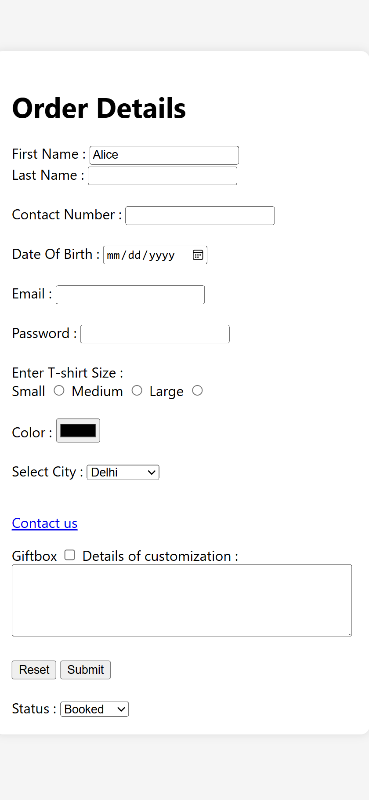

# 🧾 Customer Order Form (HTML/CSS)

A beginner-friendly responsive order form that takes customer details like name, product, quantity, and shipping address.

## 📌 Features

- Form with `label`, `input`, `select`, `textarea`
- Basic styling using CSS
- Responsive layout

## 💡 Purpose

This project helps understand how to:
- Build structured HTML forms
- Use proper input types and accessibility labels
- Style forms using CSS

## 🌐 Preview

